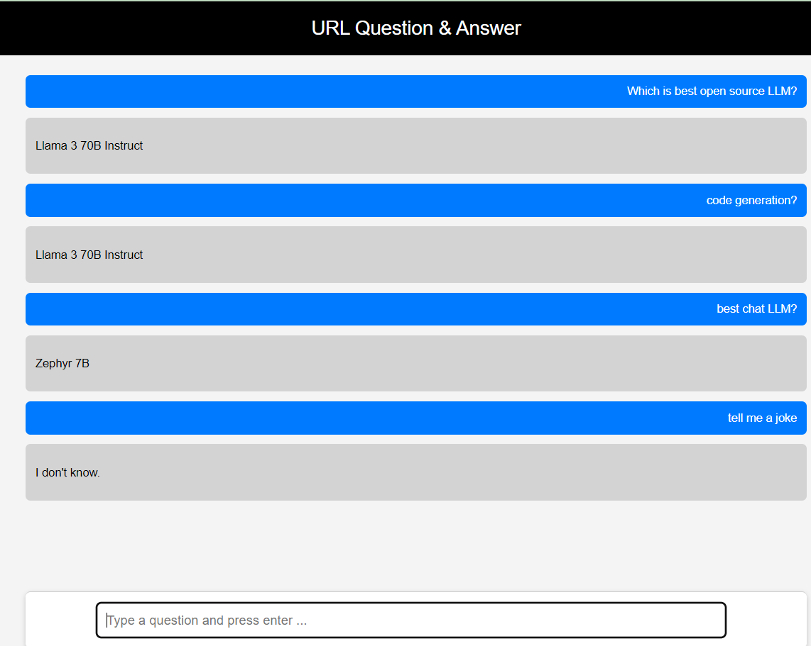
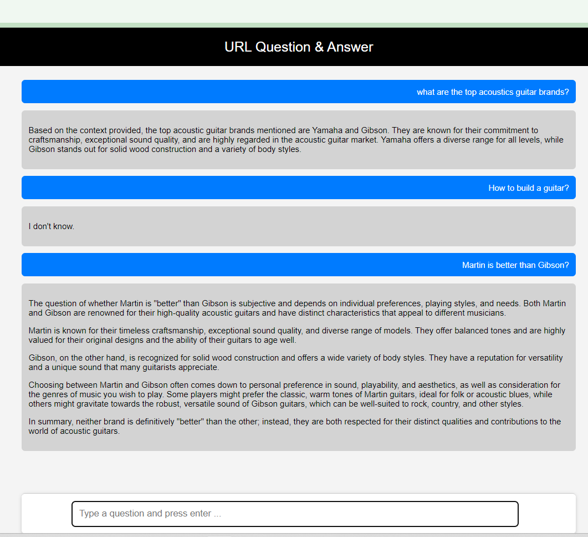

# URL Q&A
*Full-stack LLM application with OpenAI, Flask, React, and Pinecone*


This is a sample application built for the following tutorial series, "Build a full-stack LLM application with OpenAI, Flask, React, and Pinecone". It allows a user to input a URL and ask questions about the content of that webpage. It demonstrates the use of Retrieval Augmented Generation, OpenAI, and vector databases.
* **[Part 1:](https://shwinda.medium.com/ceda4e290c33](https://medium.com/@shwinda/build-a-full-stack-llm-application-with-openai-flask-react-and-pinecone-part-1-f3844429a5ef))** Backend and RAG with Python, OpenAI, and Pinecone ([branch](https://github.com/ashnkumar/llm_full_stack_tutorial/tree/part1_backend))
* **[Part 2:](https://medium.com/@shwinda/build-a-full-stack-llm-application-with-openai-flask-react-and-pinecone-part-2-ceda4e290c33)** Front-end chat user interface with React ([branch](https://github.com/ashnkumar/llm_full_stack_tutorial/tree/part2_frontend))
* **Part 3 (coming):** Tracking important metrics for a production LLM application

## Architecture


### Components of the full application:
* **Backend (Flask):** This handles the logic to scrape the website and call OpenAI's Embeddings API to create embeddings from the website's text. It also stores these embeddings in the vector database (Pinecone) and retrieves relevant text to help the LLM answer the user's question.
* **OpenAI:** We'll call two different API's from OpenAI: (1) the Embeddings API to embed the text of the website as well as the user's question, and (2) the ChatCompletions API to get an answer from GPT-4 to send back to the user.
* **Pinecone:** This is the vector database that we'll use to (1) send the embeddings of the website's text to, and (2) retrieve the most similar text chunks for constructing the prompt to send to the LLM in step 3.
* **Frontend (React):** This is the interface that the user interacts with to input a URL and ask questions about the webpage.


## Setup

**Install Python dependencies**

```sh
pip install -r requirements.txt
```
**Install React dependencies**
```sh
cd client
npm install
```

**Create .env file**
```sh
OPENAI_API_KEY=<YOUR_API_KEY>
PINECONE_API_KEY=<YOUR_API_KEY>
```

**Start the Flask server**
```sh
# In root directory
python run.py
```

**Start the React app**
```sh
cd client
npm start
```

# Links
- [flask with llm] (https://github.com/ashnkumar/llm-full-stack-tutorial/tree/part2_frontend)

- [sora] (http://buddy.edgeprop.sg/sora)

- [Pinecone Index, Create, Query] (https://github.com/openai/openai-cookbook/blob/main/examples/vector_databases/pinecone/Semantic_Search.ipynb)

# Embed & Ask

## 1 LLM Infos
- [article to index and embed] (https://www.baseten.co/blog/the-best-open-source-large-language-model/)


## 2 Guitars Info
- [guitar] (https://acousticvibesmusic.com/blogs/news/which-brand-is-best-for-acoustic-guitar)
